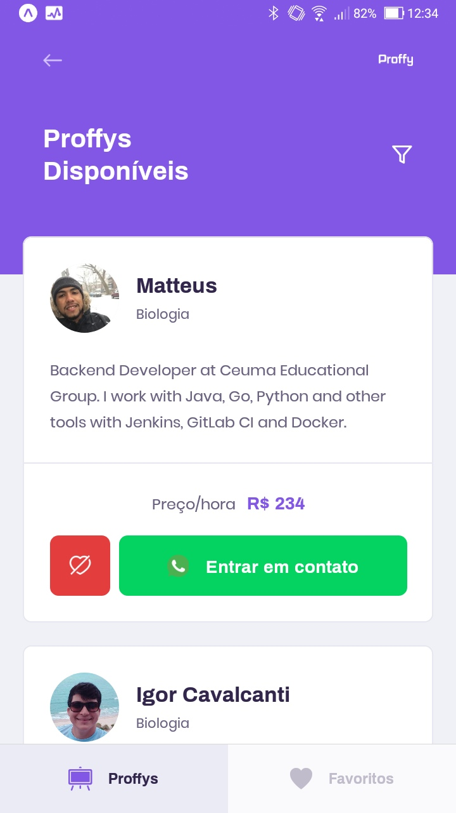

<p align="center">
  <a href="https://ant.design">
    
  </a>
</p>

<h1 align="center">Proffy</h1>

<div align="center">
Plataforma cujo objetivo é <strong>conectar quem quer estudar com quem quer dar aula</strong>.
</div>

> Essa plataforma contempla todos os dispositivos: web, mobile e tablet. Ela foi desenvolvida durante o evento chamado NLW2, promovido pela Rocketseat.


## Indice

<p align="center">
 <a href="#Features">Features</a> •
 <a href="#roadmap">Pré Requisitos</a> • 
 <a href="#tecnologias">Tecnologias</a> • 
 <a href="#autor">Autor</a> • 
 <a href="#licenc-a">Licença</a> • 
 <a href="#autor">Autor</a>
</p>
<h4 align="center"> 
	Proffy - Concluido.
</h4>

### Features

- Global
    - [x] Busca avançada de proffys disponíveis
    - [x] Listagem de proffys favoritados
    - [x] Criação de conexões
    - [x] Open chat do whatsapp do proffy
- Front
    - [x] Cadastro de aulas
    
### Screens

* Preview do Front


* Mobile Screen

<table>
<tr>
<td></td>
<td></td>
</tr>
</table>


### Pré-requisitos

Antes de começar, você vai precisar ter instalado em sua máquina as seguintes ferramentas:
[Git](https://git-scm.com), [Node.js](https://nodejs.org/en/).

### 🎲 1- Rodando o Back End (servidor)

```bash
# Clone este repositório
$ git clone <https://github.com/werliton/proffy>

# Acesse a pasta do projeto no terminal/cmd
$ cd proffy

# Vá para a pasta server
$ cd server

# Instale as dependências
$ npm install

# Execute a aplicação em modo de desenvolvimento
$ npm run dev:server

# O servidor inciará na porta:3333 - acesse <http://localhost:3333>
```
### 🎲 2 - Rodando o Front

```bash
# Clone este repositório
$ git clone <https://github.com/werliton/proffy>

# Acesse a pasta do projeto no terminal/cmd
$ cd proffy

# Vá para a pasta frontend
$ cd fronted

# Instale as dependências
$ npm install

# Execute a aplicação em modo de desenvolvimento
$ npm start

# O servidor inciará na porta:3333 - acesse <http://localhost:3333>
```

Nesse terceiro passo você precisará ter instalado no seu celular o [Expo](https://play.google.com/store/apps/details?id=host.exp.exponent&hl=pt_BR).

### 🎲 3 - Rodando o App (mobile)

```bash
# Clone este repositório
$ git clone <https://github.com/werliton/proffy>

# Acesse a pasta do projeto no terminal/cmd
$ cd proffy

# Vá para a pasta mobile
$ cd mobile

# Instale as dependências
$ npm install

# Execute a aplicação em modo de desenvolvimento
$ expo start
# O servidor inciará na porta:3333 - acesse <http://localhost:3333>
```

### Tecnologias

As seguintes ferramentas foram usadas na construção do projeto:

- [Expo](https://expo.io/)
- [Node.js](https://nodejs.org/en/)
- [React](https://pt-br.reactjs.org/)
- [React Native](https://reactnative.dev/)
- [TypeScript](https://www.typescriptlang.org/)
- [Cloud Firestore](https://firebase.google.com/docs/firestore)

### License

Licensed under the [MIT License](./LICENSE).

### Autor
---

<a href="https://www.linkedin.com/in/werliton-carlos-206b5b70/">
 
 <br />
 <sub><b>Werliton Silva</b></sub></a> <a href="hhttps://www.linkedin.com/in/werliton-carlos-206b5b70/" title="Rocketseat">🚀</a>


Feito por Werliton Silva.

Contato-me!

[](https://www.linkedin.com/in/werliton-carlos-206b5b70/) 
[](mailto:werlitoncarlos@gmail.com)